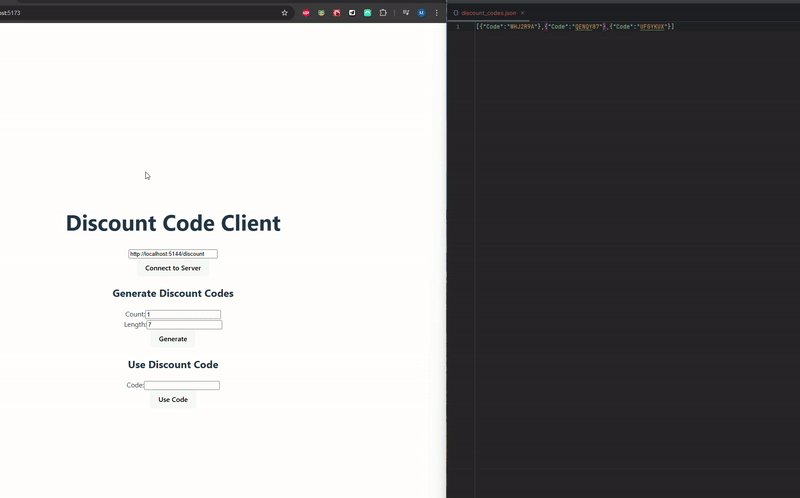

# PromoCodes Client

PromoCodes Client is a web application that allows users to generate and use discount codes by connecting to a SignalR server. This app is built using React, TypeScript, and Vite, providing a fast and efficient development experience.

## How to Use the App

This application allows you to generate and use discount codes by connecting to a SignalR server.



### How to Start the Application

To start the PromoCodes Client application, follow these steps:

1. **Install Dependencies**:
  - Open a terminal and navigate to the project directory.
  - Run the following command to install the required dependencies:
    ```sh
    npm install
    ```

2. **Start the Development Server**:
  - After the dependencies are installed, start the development server by running:
    ```sh
    npm run dev
    ```
  - This will start the Vite development server and you should see output indicating that the server is running.

3. **Open the Application in a Browser**:
  - Open your web browser and navigate to `http://localhost:3000`.
  - You should see the PromoCodes Client application running.

Now you are ready to use the PromoCodes Client application!

### Steps to Use the App

1. **Connect to the Server**:
   - Enter the server URL in the input field.
   - Click the "Connect to Server" button.
   - Once connected, you will see the server URL and connection ID.


  
2. **Generate Discount Codes**:
   - Enter the number of codes to generate in the "Count" field.
   - Enter the length of each code in the "Length" field.
   - Click the "Generate" button to generate the codes.
   - Response will be displayed as alert


  
3. **Use a Discount Code**:
   - Enter the discount code in the "Code" field (To access code list You have to check generated file in server app ).
   - Click the "Use Code" button to use the code.


### Example

1. Connect to the server at `http://localhost:5144/discount`.
2. Generate 5 discount codes of length 10.
3. Use one of the generated discount codes.
4. Check the response to see if the code was used successfully.


