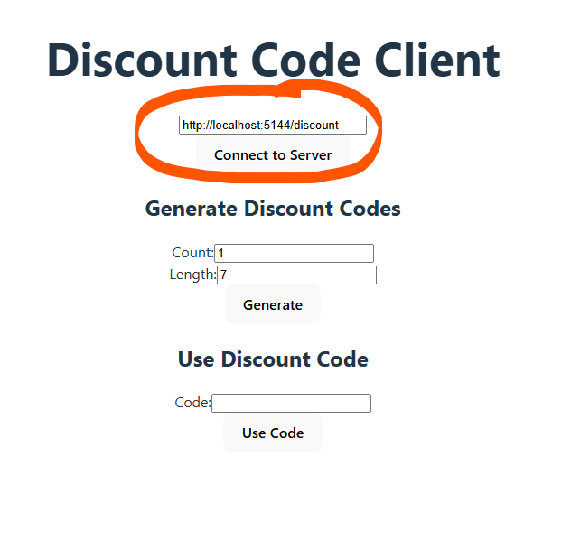
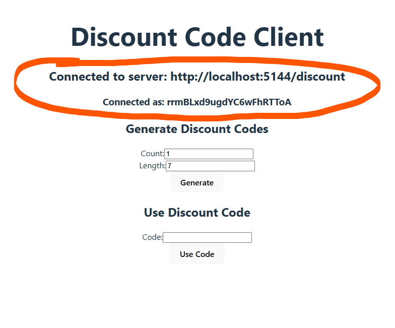
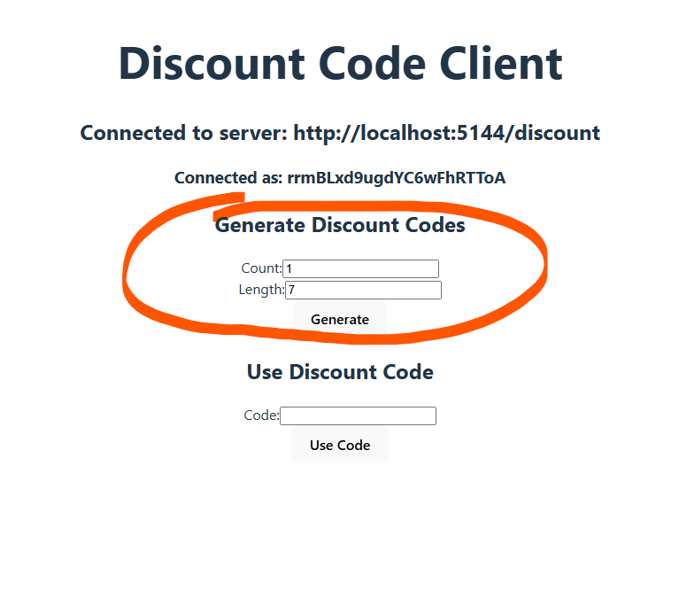
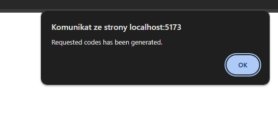
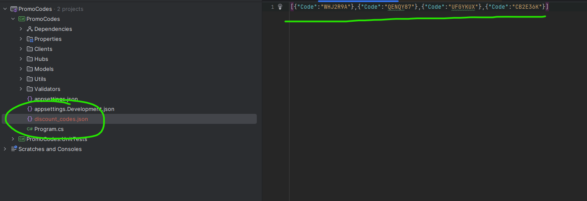
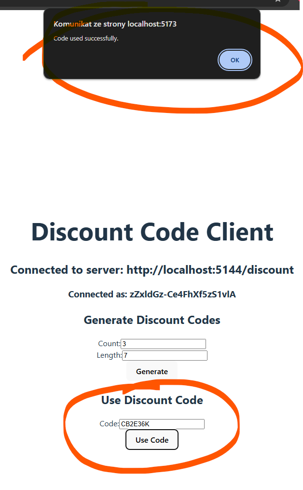

# React + TypeScript + Vite

This template provides a minimal setup to get React working in Vite with HMR and some ESLint rules.

Currently, two official plugins are available:

- [@vitejs/plugin-react](https://github.com/vitejs/vite-plugin-react/blob/main/packages/plugin-react/README.md) uses [Babel](https://babeljs.io/) for Fast Refresh
- [@vitejs/plugin-react-swc](https://github.com/vitejs/vite-plugin-react-swc) uses [SWC](https://swc.rs/) for Fast Refresh

## Expanding the ESLint configuration

If you are developing a production application, we recommend updating the configuration to enable type aware lint rules:

- Configure the top-level `parserOptions` property like this:

```js
export default tseslint.config({
  languageOptions: {
    // other options...
    parserOptions: {
      project: ['./tsconfig.node.json', './tsconfig.app.json'],
      tsconfigRootDir: import.meta.dirname,
    },
  },
})
```

- Replace `tseslint.configs.recommended` to `tseslint.configs.recommendedTypeChecked` or `tseslint.configs.strictTypeChecked`
- Optionally add `...tseslint.configs.stylisticTypeChecked`
- Install [eslint-plugin-react](https://github.com/jsx-eslint/eslint-plugin-react) and update the config:

```js
// eslint.config.js
import react from 'eslint-plugin-react'

export default tseslint.config({
  // Set the react version
  settings: { react: { version: '18.3' } },
  plugins: {
    // Add the react plugin
    react,
  },
  rules: {
    // other rules...
    // Enable its recommended rules
    ...react.configs.recommended.rules,
    ...react.configs['jsx-runtime'].rules,
  },
})
```

## How to Use the App

This application allows you to generate and use discount codes by connecting to a SignalR server.

### Steps to Use the App

1. **Connect to the Server**:
   - Enter the server URL in the input field.
   - Click the "Connect to Server" button.
   - Once connected, you will see the server URL and connection ID.




  
2. **Generate Discount Codes**:
   - Enter the number of codes to generate in the "Count" field.
   - Enter the length of each code in the "Length" field.
   - Click the "Generate" button to generate the codes.
   - Response will be displayed as alert




  
3. **Use a Discount Code**:
   - Enter the discount code in the "Code" field (To access code list You have to check generated file in server app ).
   - Click the "Use Code" button to use the code.




### Example

1. Connect to the server at `http://localhost:5144/discount`.
2. Generate 5 discount codes of length 10.
3. Use one of the generated discount codes.
4. Check the response to see if the code was used successfully.


<video controls src="./readme-content/usage-example.mp4" title="Usage Example"></video>

